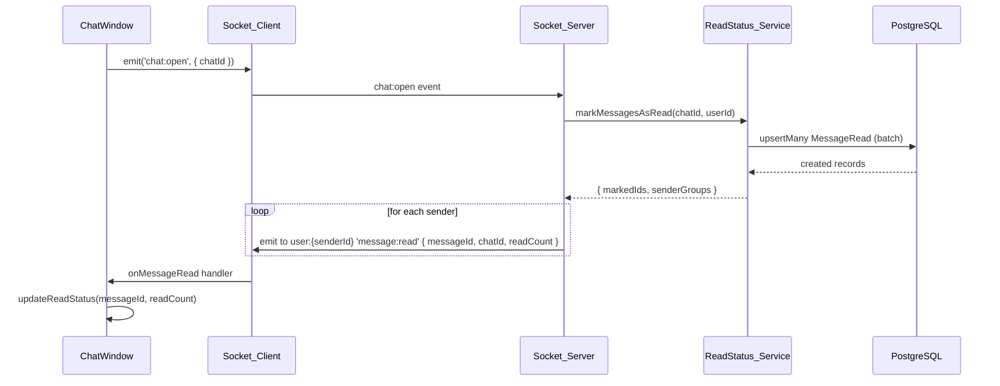
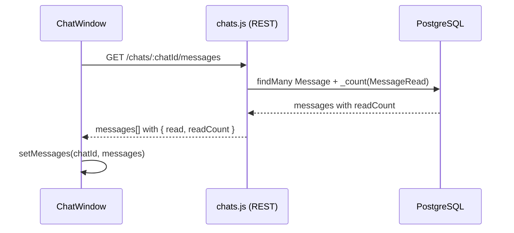

# Design Document: Message Read Status

## Overview

Фича добавляет в CocoDack систему статусов прочтения сообщений — аналогично WhatsApp/Telegram. Одна галочка означает "отправлено", две галочки — "прочитано". В групповых чатах дополнительно отображается числовой счётчик прочитавших участников в tooltip.

Статус обновляется в реальном времени через Socket.io: при открытии чата клиент отправляет событие `chat:open`, сервер создаёт записи прочтения и уведомляет отправителей через `message:read`.

Ключевое архитектурное решение: legacy поле `Message.read` (boolean) сохраняется в API-ответах для обратной совместимости с существующим UI. Новая таблица `MessageRead` хранит детальные записи прочтения.

---

## Architecture

### Компоненты системы

```
┌─────────────────────────────────────────────────────────────┐
│  Client                                                      │
│  ┌──────────────┐   chat:open    ┌──────────────────────┐   │
│  │  ChatWindow  │ ─────────────► │   socket.ts          │   │
│  │              │ ◄───────────── │   (Socket_Client)    │   │
│  │  Read_       │  message:read  └──────────────────────┘   │
│  │  Indicator   │                         │                  │
│  └──────┬───────┘                         │                  │
│         │ zustand                         │                  │
│  ┌──────▼───────┐                         │                  │
│  │  chatStore   │                         │                  │
│  └──────────────┘                         │                  │
└───────────────────────────────────────────┼─────────────────┘
                                            │ WebSocket
┌───────────────────────────────────────────┼─────────────────┐
│  Server                                   │                  │
│                                  ┌────────▼──────────┐      │
│                                  │  index.js         │      │
│                                  │  (Socket_Server)  │      │
│                                  └────────┬──────────┘      │
│                                           │                  │
│  ┌────────────────────────────────────────▼──────────────┐  │
│  │  ReadStatus_Service (server/src/services/readStatus.js)│  │
│  │  - markMessagesAsRead(chatId, userId)                  │  │
│  │  - getReadCount(messageId)                             │  │
│  └────────────────────────────────────────┬──────────────┘  │
│                                           │ Prisma           │
│  ┌────────────────────────────────────────▼──────────────┐  │
│  │  PostgreSQL                                            │  │
│  │  MessageRead table                                     │  │
│  └───────────────────────────────────────────────────────┘  │
└─────────────────────────────────────────────────────────────┘
```

### Поток данных: открытие чата



### Поток данных: загрузка истории сообщений



---

## Components and Interfaces

### Server: ReadStatus_Service

Новый модуль `server/src/services/readStatus.js`:

```js
// Помечает все непрочитанные сообщения чата как прочитанные для userId.
// Возвращает массив { messageId, senderId } для уведомления отправителей.
async function markMessagesAsRead(prisma, chatId, userId)

// Возвращает количество уникальных участников (не отправителей), прочитавших сообщение.
// Учитывает только текущих членов чата.
async function getReadCount(prisma, messageId)
```

### Server: Socket events

В `server/src/index.js` добавляется обработчик:

```js
socket.on('chat:open', async ({ chatId }) => {
  // 1. Проверить членство
  // 2. Вызвать ReadStatus_Service.markMessagesAsRead
  // 3. Для каждого затронутого отправителя:
  //    io.to(`user:${senderId}`).emit('message:read', { messageId, chatId, readCount })
})
```

Событие `message:read` payload:
```ts
{
  messageId: string
  chatId: string
  readCount: number   // количество прочитавших (для группового tooltip)
}
```

### Server: REST API изменения

В `GET /chats/:chatId/messages` добавляется `readCount` в ответ:

```js
// formatMessage расширяется:
{
  ...existingFields,
  read: boolean,       // true если все получатели прочитали (обратная совместимость)
  readCount: number    // количество прочитавших участников
}
```

Логика вычисления `read` для API:
- Личный чат: `read = MessageRead.count({ messageId }) >= 1`
- Групповой чат: `read = MessageRead.count({ messageId }) >= (totalMembers - 1)`

### Client: обновление типов

`client/src/types/index.ts` — расширение `Message`:

```ts
interface Message {
  // ...existing fields
  read: boolean       // сохраняется для обратной совместимости
  readCount?: number  // новое поле для групповых чатов
}
```

### Client: ChatStore

Новый action в `chatStore.ts`:

```ts
updateMessageReadStatus: (chatId: string, messageId: string, readCount: number) => void
```

Логика: находит сообщение по `messageId` в `messages[chatId]`, обновляет `readCount` и пересчитывает `read` на основе количества участников чата.

### Client: ChatWindow / Read_Indicator

Расширение `MessageBubble` — замена текущего `{msg.read ? '✓✓' : '✓'}`:

```tsx
// Для личного чата: read boolean достаточно
// Для группового: показываем readCount в tooltip
{isOwn && (
  <span title={isGroup && readCount > 0 ? `Прочитали: ${readCount}` : undefined}>
    {msg.read ? '✓✓' : '✓'}
    {isGroup && readCount > 0 && <sup className="text-xs">{readCount}</sup>}
  </span>
)}
```

Socket listener в `ChatWindow`:

```ts
socket.on('message:read', ({ messageId, chatId, readCount }) => {
  updateMessageReadStatus(chatId, messageId, readCount)
})
```

---

## Data Models

### Новая модель MessageRead

```prisma
model MessageRead {
  id        String   @id @default(uuid())
  messageId String
  userId    String
  readAt    DateTime @default(now())

  message Message @relation(fields: [messageId], references: [id], onDelete: Cascade)
  user    User    @relation(fields: [userId], references: [id], onDelete: Cascade)

  @@unique([messageId, userId])
}
```

### Изменения в существующих моделях

```prisma
model Message {
  // ...existing fields без изменений
  reads MessageRead[]  // новая relation
}

model User {
  // ...existing fields без изменений
  messageReads MessageRead[]  // новая relation
}
```

### Миграция

```sql
-- Migration: add_message_read_status
CREATE TABLE "MessageRead" (
    "id"        TEXT NOT NULL,
    "messageId" TEXT NOT NULL,
    "userId"    TEXT NOT NULL,
    "readAt"    TIMESTAMP(3) NOT NULL DEFAULT CURRENT_TIMESTAMP,

    CONSTRAINT "MessageRead_pkey" PRIMARY KEY ("id")
);

ALTER TABLE "MessageRead"
    ADD CONSTRAINT "MessageRead_messageId_fkey"
    FOREIGN KEY ("messageId") REFERENCES "Message"("id") ON DELETE CASCADE ON UPDATE CASCADE;

ALTER TABLE "MessageRead"
    ADD CONSTRAINT "MessageRead_userId_fkey"
    FOREIGN KEY ("userId") REFERENCES "User"("id") ON DELETE CASCADE ON UPDATE CASCADE;

CREATE UNIQUE INDEX "MessageRead_messageId_userId_key" ON "MessageRead"("messageId", "userId");
```

Поле `Message.read` остаётся в схеме — оно будет вычисляться динамически при запросах и не требует удаления для обратной совместимости.

---

## Correctness Properties

*A property is a characteristic or behavior that should hold true across all valid executions of a system — essentially, a formal statement about what the system should do. Properties serve as the bridge between human-readable specifications and machine-verifiable correctness guarantees.*

### Property 1: Идемпотентность пометки прочтения

*For any* сообщения и пользователя, вызов `markMessagesAsRead` дважды подряд должен создать ровно одну запись `MessageRead` — повторный вызов не создаёт дубликатов и не изменяет `readAt` первой записи.

**Validates: Requirements 1.2, 5.5**

---

### Property 2: Полнота пакетной пометки

*For any* чата и пользователя, после вызова `markMessagesAsRead(chatId, userId)` каждое сообщение в этом чате, отправленное другим пользователем, должно иметь запись `MessageRead` для данного `userId`.

**Validates: Requirements 1.3, 5.3**

---

### Property 3: Round-trip записи MessageRead

*For any* валидной записи `MessageRead` (messageId, userId, readAt), запись в БД и последующее чтение должны вернуть идентичные значения всех трёх полей.

**Validates: Requirements 1.5**

---

### Property 4: Корректность счётчика прочитавших

*For any* сообщения, `getReadCount(messageId)` должен возвращать количество, равное числу уникальных `userId` в таблице `MessageRead` для данного `messageId`, пересечённому с текущими членами чата.

**Validates: Requirements 1.4, 6.1**

---

### Property 5: Рендеринг индикатора прочтения

*For any* сообщения с `read = false`, индикатор должен отображать одну галочку; для сообщения с `read = true` — две галочки. Индикатор должен присутствовать только у сообщений, где `senderId === currentUserId`.

**Validates: Requirements 2.1, 2.3, 2.5, 3.1**

---

### Property 6: Порог двойной галочки в групповом чате

*For any* группового чата с N участниками, сообщение должно иметь `read = true` тогда и только тогда, когда `readCount >= N - 1` (все участники кроме отправителя прочитали).

**Validates: Requirements 3.3, 3.4**

---

### Property 7: Tooltip счётчика в групповом чате

*For any* сообщения в групповом чате с `readCount > 0`, отрендеренный индикатор должен содержать числовое значение `readCount` в атрибуте `title` или в видимом элементе.

**Validates: Requirements 3.5**

---

### Property 8: Обновление стора при получении message:read

*For any* события `message:read` с payload `{ messageId, chatId, readCount }`, после его обработки `chatStore` должен содержать сообщение с обновлёнными полями `readCount` и пересчитанным `read`.

**Validates: Requirements 4.2**

---

### Property 9: Консистентность API-ответа со статусом прочтения

*For any* сообщения, возвращаемого `GET /chats/:chatId/messages`, поле `read` должно соответствовать фактическому состоянию записей `MessageRead` в БД на момент запроса.

**Validates: Requirements 5.1**

---

### Property 10: Атомарность пакетной пометки

*For any* набора непрочитанных сообщений в чате, операция `markMessagesAsRead` должна либо создать записи для всех сообщений, либо не создать ни одной (транзакционная атомарность).

**Validates: Requirements 5.4**

---

### Property 11: Каскадное удаление записей MessageRead

*For any* удалённого сообщения, в таблице `MessageRead` не должно оставаться ни одной записи с данным `messageId`.

**Validates: Requirements 6.2**

---

### Property 12: Исключение записей для отправителя

*For any* пользователя, открывающего чат, `markMessagesAsRead` не должен создавать записи `MessageRead` для сообщений, где `senderId === userId`.

**Validates: Requirements 6.3**

---

## Error Handling

| Сценарий | Обработка |
|---|---|
| `chat:open` от не-члена чата | Игнорировать событие, не создавать записи |
| Ошибка БД при batch upsert | Транзакция откатывается, событие `message:read` не отправляется |
| `message:read` для несуществующего сообщения в сторе | Игнорировать (сообщение могло быть удалено) |
| Пользователь удалён из чата во время открытой сессии | `getReadCount` фильтрует по текущим членам через JOIN с `ChatMember` |
| Дублирующий `chat:open` (быстрое переключение) | Upsert гарантирует идемпотентность, повторные события `message:read` безопасны |

---

## Testing Strategy

### Подход

Используется двойная стратегия тестирования:
- **Unit/integration тесты** — конкретные примеры, граничные случаи, проверка интеграции слоёв
- **Property-based тесты** — универсальные свойства на случайных входных данных

### Property-Based Testing

Библиотека: **fast-check** (TypeScript/JavaScript)

Каждый property-тест запускается минимум **100 итераций**.

Формат тега: `Feature: message-read-status, Property {N}: {property_text}`

| Property | Тест | Генераторы |
|---|---|---|
| P1: Идемпотентность | Вызвать `markMessagesAsRead` дважды, проверить count=1 | fc.uuid() для messageId/userId |
| P2: Полнота пометки | После `markMessagesAsRead` проверить все сообщения чужих | fc.array(fc.record({...})) |
| P3: Round-trip | Записать MessageRead, прочитать, сравнить поля | fc.record({ messageId, userId }) |
| P4: Счётчик прочитавших | Создать N записей, проверить getReadCount = N | fc.integer({ min: 1, max: 20 }) |
| P5: Рендеринг индикатора | Для read=false → '✓', read=true → '✓✓', только isOwn | fc.boolean(), fc.string() |
| P6: Порог двойной галочки | readCount >= N-1 ↔ read=true | fc.integer({ min: 2, max: 10 }) |
| P7: Tooltip счётчика | readCount > 0 → title содержит число | fc.integer({ min: 1, max: 50 }) |
| P8: Обновление стора | Dispatch message:read → store обновлён | fc.record({ messageId, chatId, readCount }) |
| P9: Консистентность API | API read = (DB MessageRead count >= threshold) | fc.array(fc.uuid()) |
| P10: Атомарность | При ошибке в середине — 0 записей | Мок ошибки БД |
| P11: Каскадное удаление | После delete message → MessageRead.count = 0 | fc.uuid() |
| P12: Исключение отправителя | markAsRead не создаёт запись для senderId=userId | fc.uuid() |

### Unit / Integration тесты

- `GET /chats/:chatId/messages` возвращает корректные `read` и `readCount`
- `chat:open` от не-члена чата игнорируется
- `message:read` событие отправляется только отправителю, не всей комнате
- Граничный случай: групповой чат с 2 участниками (N-1=1) ведёт себя как личный
- Граничный случай: пустой чат (нет непрочитанных) — нет новых записей
- Интеграция: отправка сообщения в чат с онлайн-получателем → немедленная пометка
